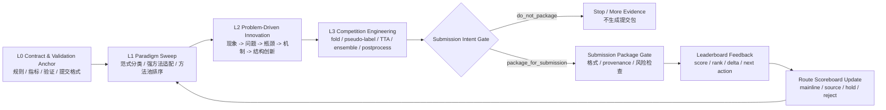

# One-Page Workflow

## 竞赛冲榜 Agent Workflow



## 三个关键原则

1. **先锚定评价，再跑方法**

   L0 先确认规则、指标、本地验证和提交契约。验证不可信时，后续结论必须标记为 provisional。

2. **先扫成熟范式，再做结构创新**

   L1 负责强方法适配，L2 只处理基于瓶颈的问题驱动结构创新。不能把“加 loss / 加 adapter / 加 attention”直接当创新。

3. **先过意图门，再生成提交包**

   只有 `package_for_submission` 才允许生成提交包。`do_not_package` 就停止，不浪费提交机会。

## 评委能记住的一句话

```text
普通 AI 冲榜是“问一个方法然后试着交”；这个 workflow 是“建立评价、管理路线、证明瓶颈、门控提交”。
```
